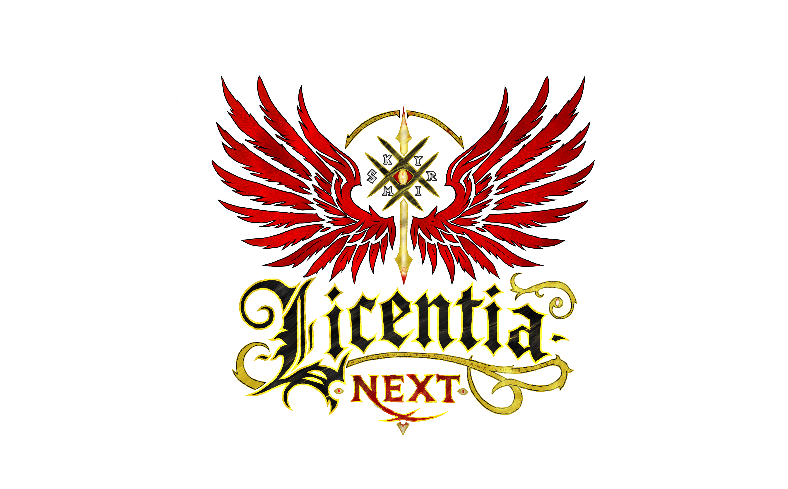

## ⁉️ What is this

This is a repository for Skyrim modlist **Licentia NEXT**.

> [!TIP]
> All the documentation has been moved to **our new website** - https://licentia.quest
>
> Please visit it for all the relevant info and updates! *(it's pretty 🦋)*

## 🧬 Repository structure

Here's the structure of this repo if someone is interested:
- `.github` folder - GitHub Actions pipeline to build and deploy our website;
- [backup](/backup/) folder - you can find old documentation in there, not maintained anymore;
- [website](/website/) folder - sources for our website with actively maintained documentation and other vices;
- `.gitignore` file - *`DS_Store` begone!*;
- [LICENSE.md](/LICENSE.md) file - well, self explanatory;
- [modlists.json](/modlists.json) file - that's a file required by *Wabbajack*;
- [README.md](/README.md) - you're here 👋